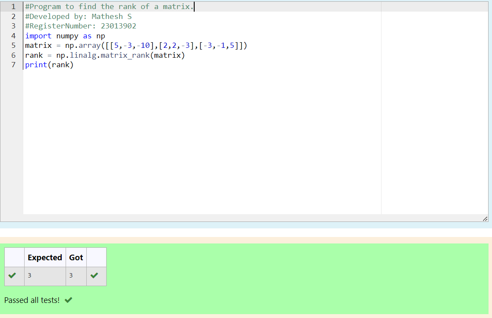

# INVERSE-OF-A-MATRIX
## Aim:
To write a python program to find the inverse of a matrix

## Equipment’s required:
1. 	Hardware – PCs
2. 	Anaconda – Python 3.7 Installation / Moodle-Code Runner

## Algorithm:

### Step1 : 
Import the numpy module to use the built-in functions for calculation

### Step 2:
Prepare the lists from each inverse of a matrix and assign in np.array()

### Step 3:
Using the np.linalg.inv(),we can find the inverse of the given matrix

### Step 4:
End the program


## Program:
```
#Program to find the rank of a matrix.
#Developed by: Mathesh S
#RegisterNumber: 23013902
import numpy as np
matrix = np.array([[5,-3,-10],[2,2,-3],[-3,-1,5]])
rank = np.linalg.matrix_rank(matrix)
print(rank)

```
## Output:


## Result:
Thus the inverse of given matrix is successfully solved using python program

